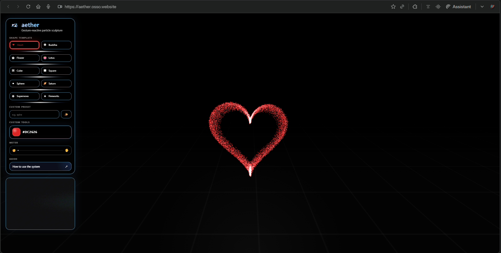

# aether



Interactive 3D particle sculpture built with Next.js, Three.js, and MediaPipe.  
The experience combines hand tracking, animated particle presets, custom shape generation, a custom sidebar UI, and a realtime gesture meter.

## Overview

`aether` is a browser-based visual sculpture system:

- switch between handcrafted particle presets
- control expansion with your hand through the camera
- generate custom particle shapes from text prompts like `circle`, `octagon`, or `star`
- customize the active particle color
- share a preset directly through the URL

## Features

- Next.js App Router setup, ready for Vercel
- Three.js particle rendering with animated preset behaviors
- MediaPipe hand tracking for live gesture control
- Preset routing via URL query params
- Custom preset input for simple generated shapes
- Realtime meter UI linked to hand openness
- Onboarding guide popup
- Custom preloader and polished sidebar interface

## Built-in Presets

- Heart
- Buddha
- Flower
- Lotus
- Cube
- Square
- Sphere
- Saturn
- Supernova
- Fireworks

## Custom Presets

The custom preset field currently supports local generated shapes such as:

- `circle`
- `octagon`
- `hexagon`
- `triangle`
- `diamond`
- `star`
- `spiral`

French aliases like `rond`, `cercle`, and `octogone` are also supported.

## Tech Stack

- Next.js 16
- React 19
- Three.js
- MediaPipe Hands
- Vercel Analytics

## Getting Started

Install dependencies:

```bash
npm install
```

Run the development server:

```bash
npm run dev
```

Open [http://localhost:3000](http://localhost:3000).

## Production

Build the app:

```bash
npm run build
```

Start production locally:

```bash
npm run start
```

## Deployment

The project is configured as a standard Next.js app and can be deployed directly on Vercel.

## Notes

- Camera access is required for gesture interaction.
- If the camera is already used by another app, gesture tracking will not start.
- Custom presets are lightweight local generators, not full AI-generated 3D models.
